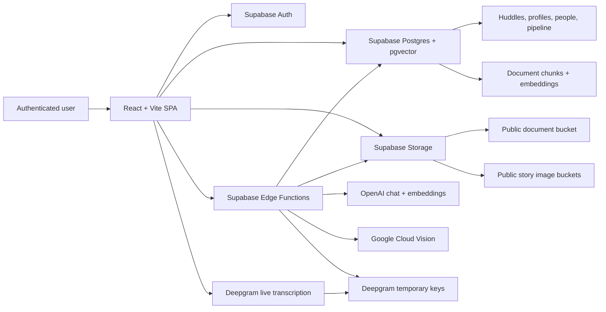
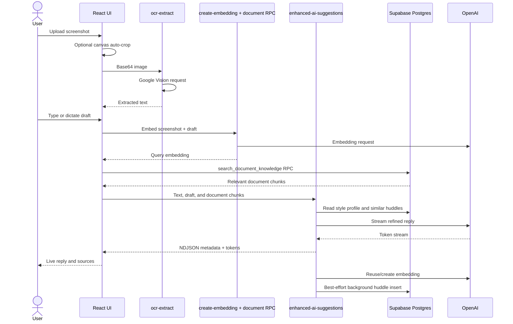
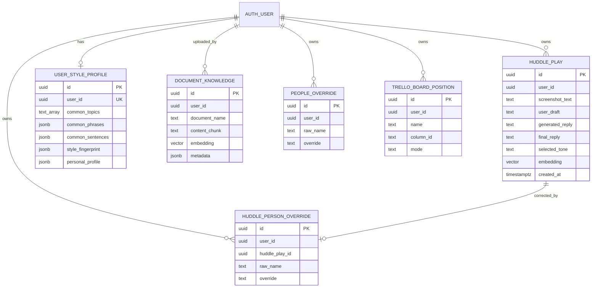
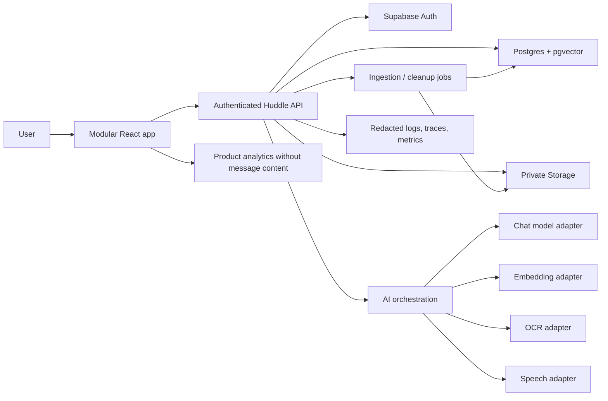

# Huddle Play Architecture

Status: Current-state review and target-state revamp blueprint
Reviewed: 2026-07-26
Repository baseline: `main` at `5a6b78b`

## 1. Executive summary

Huddle Play is an authenticated, AI-assisted reply workspace for relationship-based conversations. A user uploads a conversation screenshot, supplies the intent of their response by typing or speaking, and receives a refined reply shaped by:

- OCR text from the screenshot;
- the user's draft and requested tone;
- semantically similar past huddles;
- a learned writing-style profile;
- relevant chunks from a document knowledge base.

The app also includes batch reply generation, Instagram Story reply ideas, searchable reply history, style fingerprinting, contact/name inference, and a Trello-like relationship pipeline.

The current system is a React single-page application backed by Supabase Auth, Postgres, Storage, RPC functions, and Edge Functions. OpenAI supplies chat and embedding models, Google Cloud Vision supplies OCR, and Deepgram supplies live transcription.

The core concept is sound, but the implementation has accumulated duplicated paths, oversized modules, partially connected features, privacy risks, and weak server-side authorization boundaries. The target architecture should preserve the useful product behavior while moving identity, retrieval, provider access, persistence, and policy enforcement behind a small authenticated application API.

## 2. Review coverage

The review covered all 180 tracked repository files.

| Area | Coverage | Notes |
| --- | ---: | --- |
| React/TypeScript source | 113 files | Entry points, pages, feature components, hooks, services, utilities, generated Supabase types, tests, and 49 UI primitives |
| Supabase Edge Functions | 11 functions | All handlers, prompts, provider calls, auth handling, persistence, and error behavior |
| Database migrations | 17 migrations | Tables, policies, storage buckets, vector RPCs, and later schema additions |
| Domain PDFs | 4 PDFs / 23 pages | DTM, FAQ, MPA, and OLB playbooks; text and rendered pages reviewed |
| Infrastructure | All tracked files | Vite, TypeScript, Tailwind, Docker, Nginx, Supabase config, environment keys, and deployment metadata |
| Dependency artifacts | Both lockfiles | `package-lock.json` inspected structurally and audited; legacy binary `bun.lockb` identified and checksummed |
| Static assets | All assets | Favicon, placeholder SVG, and robots policy reviewed |

Generated UI primitives and generated Supabase types were reviewed as framework artifacts rather than treated as product-specific business logic. Environment values were not reproduced in this document.

## 3. What the current app does

### 3.1 Authentication and entry

- `/` shows a sign-in/sign-up landing page when signed out and the application shell when signed in.
- Email/password authentication and email confirmation use Supabase Auth.
- `/flow` is a public-facing product walkthrough, although the global auth wrapper still initializes before rendering it.
- A role read from `user.user_metadata.role` controls whether document administration is displayed.

### 3.2 Single Huddle reply

1. The user uploads a PNG/JPG conversation screenshot.
2. The browser optionally crops apparent content on a canvas.
3. `ocr-extract` sends the image to Google Cloud Vision.
4. The user types a draft or dictates it through Deepgram.
5. The browser creates an embedding for the combined screenshot and draft, then searches the global document knowledge RPC.
6. `enhanced-ai-suggestions` retrieves the user's style profile and similar past huddles.
7. OpenAI streams a refined reply as newline-delimited JSON.
8. The browser displays the stream, allows regeneration and tone adjustment, and exposes the huddle/document sources.
9. The server attempts to embed and store the huddle after streaming completes.

### 3.3 Batch Huddles

- Up to three screenshots can be queued.
- OCR runs when each file is added.
- Each item has its own draft, reply, tone, source counts, copy action, and regeneration action.
- "Generate all" processes the queue sequentially.
- The settings copy says five screenshots, while the implementation limit is three.

### 3.4 Story interruptions

- Up to five Instagram Story screenshots can be uploaded.
- Each file is stored in the public `story_images` bucket, OCR'd, and sent to an OpenAI vision-capable model.
- The function returns short conversation starters grounded in visible story content and, when available, a style profile.
- The service defaults to three suggestions, while the UI promises five.

### 3.5 History and style learning

- The History tab fetches up to 100 huddles in pages of 25.
- Huddles are grouped into domain categories such as OLB, MPA, DTM, FAQs, and general conversations.
- Semantic search uses a query embedding and `match_huddle_plays`.
- "Refresh my fingerprint" analyzes up to 200 user drafts for:
  - common topics;
  - repeated bigrams and trigrams;
  - repeated sentences;
  - typical message length;
  - emoji, punctuation, capitalization, greetings, closings, and slang;
  - editable personal profile details.
- The user can review and save the resulting style profile.

### 3.6 Contacts and pipeline

- Names are inferred from OCR using deterministic heuristics, with an LLM fallback for unknown names.
- Per-name and per-huddle corrections are stored locally and in Supabase.
- The Trello tab derives contacts from saved huddles and places them in:
  - conversation stages: Unassigned, OLB, MPA, DTM, STP, Removed;
  - process stages: Meet and Greet 1/2, FU1/2/3, PRC.
- Placements persist in both local storage and `trello_board_positions`.
- `PeopleTab.tsx` implements a separate contact browser but is not reachable from the current navigation.

### 3.7 Knowledge administration

- Admin users can list PDFs in the `documents` storage bucket.
- The browser downloads and parses PDFs with PDF.js.
- Content is split by `--- CHUNK N ---` markers, normalized as Markdown, embedded, and inserted one row per marker.
- Document chunks are globally searchable by authenticated users.
- Four domain playbooks are committed under `src/Docs`, but they are not imported by the app and therefore are not part of the runtime build. They appear intended as source material for manual storage ingestion.

## 4. Current system context



## 5. Current reply-generation sequence



## 6. Frontend architecture

### 6.1 Runtime composition

`src/main.tsx` mounts `App.tsx`, which provides:

- TanStack Query;
- tooltip and toast providers;
- `AuthWrapper`;
- React Router.

The signed-in `MainApp` owns two broad state aggregates:

- `useHuddleState` for the reply workflow;
- `useInterruptions` for Story reply generation.

Four top-level tabs are rendered and force-mounted:

1. Huddle;
2. Trello;
3. Interruption;
4. History.

### 6.2 State model

State is spread across:

- React component state;
- feature hooks;
- singleton services such as `ocrService`;
- browser `localStorage`;
- Supabase tables;
- server-side generation state.

Local storage currently retains:

- reply drafts;
- theme and Huddle mode;
- obsolete Google OCR settings;
- people and per-message name overrides;
- Trello boards, hidden names, activity timestamps, and AI name guesses.

This creates two sources of truth for contacts and board state. Synchronization is implemented independently in `PeopleTab` and `TrelloTab`.

### 6.3 Source reachability

A dependency walk from `src/main.tsx` reaches 74 of 113 TypeScript source files. The remaining 39 include tests, unused shadcn primitives, and dormant product code:

- `PeopleTab.tsx`;
- `ApiKeyInput.tsx`;
- `OCRSettings.tsx`;
- `ThumbsCarousel.tsx`;
- `useAISuggestions.ts` and `utils/aiSuggestions.ts`;
- `usePastHuddlesKnowledge.ts`;
- numerous unused UI primitives.

The dormant files are not inherently harmful, but they obscure the actual product surface and keep unnecessary dependencies in the repository.

### 6.4 Large modules

The most concentrated modules are:

| Module | Approx. lines | Responsibility |
| --- | ---: | --- |
| `supabase/functions/enhanced-ai-suggestions/index.ts` | 1,704 | Generation, streaming, retrieval, persistence, tone, style analysis, style writes, and health |
| `src/components/TrelloTab.tsx` | 1,518 | Contact derivation, name repair, two boards, persistence, drag/drop, and detail UI |
| `src/components/PastHuddlesTab.tsx` | 1,103 | History, search, categories, virtualization, style analysis editor, and profile preview |
| `src/components/BatchHuddlesSection.tsx` | 626 | Batch upload, OCR, generation, tone, copying, and queue UI |

These modules cross domain boundaries and are difficult to test independently.

## 7. Backend and provider map

| Edge Function | Current responsibility | Provider/model |
| --- | --- | --- |
| `enhanced-ai-suggestions` | Core streaming generation, tone changes, style analysis, style persistence, health | `gpt-5.4-nano` first pass, `gpt-5-mini` regeneration fallback, `gpt-4o-mini` tone adjustment, `text-embedding-3-small` |
| `ai-suggestions` | Legacy non-streaming generation and tone adjustment | `gpt-5-mini` |
| `create-embedding` | Search embeddings and document-chunk inserts | `text-embedding-3-small` |
| `search-past-huddles` | Semantic history search | `text-embedding-3-small` |
| `ocr-extract` | Google service-account exchange and OCR | Google Cloud Vision |
| `deepgram-token` | Creates a 10-minute Deepgram key | Deepgram |
| `generate-story-interruptions` | Story image/text analysis and reply options | `gpt-4o-mini` |
| `extract-name` | LLM fallback name extraction | `gpt-4o-mini` |
| `pdf-extract` | Legacy server-side PDF extraction and chunking | Local parsing |
| `delete-all-documents` | Deletes a user's document rows and user-path storage files | Supabase |
| `keep-alive` | Calls the enhanced function health action | Supabase |

## 8. Current data architecture



Important schema observations:

- The generated types contain `document_knowledge`, but no checked-in migration creates its base table.
- Two public Story buckets exist: `story-images` and `story_images`; only the underscore version is used by the frontend.
- The document bucket is public, including anonymous read access.
- A later migration intentionally makes document chunks readable to every authenticated user.
- Vector search functions accept user identity as a parameter rather than deriving it inside the function from `auth.uid()`.

## 9. Deployment architecture

- Vite builds a static SPA.
- The Dockerfile uses Node 18 to run `npm install` and `npm run build`.
- Nginx serves the output and falls back to `index.html` for client-side routes.
- `default.conf.template` expects a runtime `PORT`.
- The Flow page links to a Railway production URL.
- There is no checked-in CI workflow, release workflow, automated migration check, or environment contract.

Deployment issues to address:

- `nginx:stable-alpine` does not guarantee that `curl` exists, yet the health check calls it.
- The build uses `npm install` instead of deterministic `npm ci`.
- The container is based on Node 18, which is no longer a suitable long-term revamp baseline.
- The README remains the generic Lovable starter and does not document the real system.

## 10. Validation snapshot

Validation was run against the reviewed commit:

| Check | Result |
| --- | --- |
| Production Vite build | Pass |
| Unit tests | 11/11 pass across two utility test files |
| ESLint | Fails: 5 errors and 7 warnings |
| Dependency audit | 19 findings: 1 critical, 14 high, 3 moderate, 1 low |
| Initial JavaScript bundle | 3,059.66 kB minified / 1,430.48 kB gzip |
| CSS bundle | 132.47 kB minified / 21.06 kB gzip |
| Source syntax parse | 126 TS/TSX/JS files parsed with no syntax errors |
| Targeted type check | Finds unresolved `HuddlePlay` in batch code and missing `documentService.processUploadedFile` |

The Vite build transpiles TypeScript but does not enforce a full type check, so a successful build currently does not imply type correctness.

## 11. Highest-priority current risks

### 11.1 Critical security and privacy risks

1. `ocr-extract` logs the first 50 characters of the Google private key and may log the first 100 characters on failure. The credential should be rotated after the logging is removed.
2. Several service-role functions trust a client-provided `userId` or `user_id`. This can bypass RLS and risks cross-user reads or writes.
3. Story images and documents are stored in public buckets. Story files are not removed after generation.
4. `generate-story-interruptions` can fetch an arbitrary HTTP/HTTPS URL, creating an SSRF boundary.
5. The frontend decides admin access from mutable user metadata. Authorization must be enforced with server-owned roles or database policies.
6. Raw screenshots, drafts, document chunks, profile data, and replies are written to application logs in several code paths.
7. Storage policies allow broadly authenticated users to manage files without an owner-path constraint.

### 11.2 Correctness and reliability risks

1. The core UI never calls `saveCurrentHuddle` or receives the inserted huddle ID from the stream. `currentHuddleId` remains unset, so tone adjustments and regenerations do not update the original record.
2. Huddle persistence runs as an unregistered background promise after streaming. An Edge runtime may terminate before the insert completes.
3. Retry composition can trigger up to five server attempts, an automatic second five-attempt pass, and additional batch-level retries. This makes cost and latency unpredictable.
4. `processUploadedFile` and `docx-extract` are referenced but not implemented in the repository.
5. `BatchHuddlesSection.tsx` references `HuddlePlay` without importing the type.
6. The "light" history query still selects full screenshot, draft, and generated-reply text.
7. Fixed-height virtualization is used for cards whose heights change when expanded.
8. Deepgram media tracks are not explicitly stopped when recording ends.
9. OCR processing uses a singleton service and an `O(width * height)` nested boolean matrix for desktop auto-cropping.
10. Story object URLs and remote files are cleaned up only in some user-driven paths.

### 11.3 Maintainability and product coherence risks

- Two reply engines and multiple search paths coexist.
- Contact/name logic is duplicated between an unreachable People tab and the Trello tab.
- There are two toast systems and many unused UI primitives.
- Product copy and implementation disagree on batch size and Story suggestion count.
- The four bundled PDFs are disconnected from the ingestion workflow.
- Large components mix persistence, provider logic, business rules, and rendering.
- Only name extraction and reply sanitization have unit tests.
- No analytics distinguish generated, accepted, copied, regenerated, or abandoned replies.

## 12. Target architecture

### 12.1 Design principles

1. Derive identity on the server from the verified access token.
2. Store personal conversation media privately and for the shortest practical period.
3. Create a Huddle record before generation so every OCR result, generation, source, and final user action has a durable ID.
4. Keep retrieval and prompt construction server-side.
5. Separate provider adapters from product policy.
6. Treat "accepted/copied by the user" as the learning signal, not every generated draft.
7. Make all generation operations idempotent, cancellable, observable, and cost-bounded.
8. Split the UI by product domain, with server state managed consistently through TanStack Query.

### 12.2 Proposed system



### 12.3 Target domain modules

```text
src/
  app/                 routing, providers, layout
  features/
    auth/
    huddles/           capture, OCR review, draft, generation, acceptance
    history/           search, detail, deletion
    style-profile/     analysis, review, settings
    contacts/          inferred contact, correction, history
    pipeline/          stage definitions and positions
    knowledge/         documents, chunks, ingestion status
    story-replies/     optional source type within the composer
    batch/             queue built on the same Huddle API
  shared/
    api/
    ui/
    validation/
    telemetry/

supabase/
  functions/
    huddles-create/
    huddles-ocr/
    huddles-generate/
    huddles-accept/
    huddles-search/
    style-profile/
    documents-ingest/
    speech-token/
  migrations/
```

The exact number of Edge Functions can be reduced if a small router is preferred, but each handler should have one authorization model and one bounded responsibility.

### 12.4 Target Huddle lifecycle

1. `POST /huddles` creates a draft Huddle and returns `huddle_id`.
2. The screenshot is uploaded to a private, owner-scoped path or sent directly for OCR.
3. OCR text is persisted against the Huddle and shown to the user for correction.
4. `POST /huddles/{id}/generations` performs server-side retrieval and begins a stream.
5. Each generation stores:
   - prompt version;
   - provider/model;
   - retrieval source IDs and scores;
   - latency and token/cost metadata;
   - generated reply;
   - status and error code.
6. Regeneration and tone changes create child generations instead of mutating history.
7. Copy/accept records the selected generation and final user-edited text.
8. Only accepted text feeds style analysis and similarity memory.
9. Temporary media is automatically deleted.

### 12.5 Target data model

Recommended additions and changes:

- `huddles`: durable workflow record with user, contact, source type, OCR text, user intent, and status.
- `huddle_media`: private object reference, media type, deletion time, and processing status.
- `generations`: immutable generation attempts with parent/variant relationship and model metadata.
- `generation_sources`: join table to past huddles and document chunks.
- `contacts`: first-class contact identity instead of inferred names as board keys.
- `contact_aliases`: raw OCR names and corrected aliases.
- `pipeline_stages` and `contact_pipeline_positions`: typed, configurable stages.
- `knowledge_documents`: owner/workspace, storage path, status, checksum, and version.
- `knowledge_chunks`: document FK, content, embedding, page/line metadata.
- `style_profiles`: versioned profile derived from accepted replies, plus user-edited settings.
- `user_roles`: server-owned role assignments, or equivalent `app_metadata`.

Existing data can be migrated incrementally. `huddle_plays` can remain readable while new writes target the new schema.

### 12.6 API and policy requirements

- Every handler verifies the bearer token.
- User IDs are never accepted as authority from request bodies.
- RPCs use `auth.uid()` or receive identity only from a trusted service layer.
- Zod or an equivalent schema validates all requests and responses.
- Rate limits are applied per user and per operation.
- Provider timeouts and retries are centralized and capped.
- Raw content is redacted from logs by default.
- Storage is private and uses signed URLs only when necessary.
- CORS is restricted to configured origins.
- Prompt templates and safety rules are versioned and testable.
- Search returns IDs and short previews first; full content is hydrated only when opened.

## 13. Migration plan

### Phase 0: Contain risk

- Remove all credential and raw-message logging.
- Rotate the Google service-account key.
- Make Story and document storage private.
- Bind every service-role operation to the authenticated user.
- Block arbitrary Story image URLs.
- Add rate limits and bounded retries.

### Phase 1: Stabilize the core loop

- Introduce a durable Huddle ID before OCR/generation.
- Consolidate to one generation API and one retrieval path.
- Persist every generation and acceptance deterministically.
- Add type checking, CI, integration tests, and provider mocks.
- Split and lazy-load the initial bundle.

### Phase 2: Rebuild personalization

- Train the style profile only from accepted or edited replies.
- Move document retrieval fully server-side.
- Add clear source provenance and relevance behavior.
- Migrate contacts and pipeline positions to first-class IDs.

### Phase 3: Restore secondary workflows

- Rebuild batch generation on the same Huddle state machine.
- Fold Story replies into a source-type mode with private temporary media.
- Reintroduce only the document administration and contact UI that users actually need.

## 14. Architectural decisions to confirm

1. Is the product individual-only, or should the revamp support teams/coaches and shared knowledge?
2. Are the OLB/MPA/DTM/FAQ playbooks global product knowledge or private user documents?
3. Is the relationship pipeline a core product pillar or an optional companion workflow?
4. Should Story replies remain a primary workflow?
5. What message/media retention period is acceptable?
6. Which provider requirements are fixed versus replaceable?
7. Does the product need subscription plans, usage quotas, or administrator-managed invitations?
