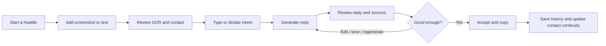

# Huddle Play Revamp PRD

Status: Core revamp implemented; product validation continues
Date: 2026-07-26
Architecture reference: `ARCHITECTURE.md`

Implemented in the 2026-07-26 revamp pass: durable Huddles and generations, accepted-reply signals, source and token ledgers, authenticated server-side retrieval, idempotent bounded retries, evaluation-gated low-cost routing, no reply output-token cap, private Story inputs, and the mobile-first Reply/History shell. Contact consolidation and fully scoped/versioned knowledge administration remain follow-up product work.

## 1. Product decision

Revamp Huddle Play around one dependable promise:

> Turn a conversation screenshot and the user's intent into a human, context-aware reply that the user remains fully in control of.

The revamp should prioritize the core reply loop before restoring batch, Story, contact, and pipeline breadth. The existing app proves the useful ingredients, but the new product should feel like one coherent assistant rather than several adjacent tools.

## 2. Positioning assumption

The current prompts, pipeline stages, and bundled playbooks indicate a primary audience of relationship-based sellers and network marketers who use social conversations to build rapport, discuss mentorship, and guide contacts through OLB, MPA, DTM, and follow-up stages.

This audience and terminology must be validated before finalizing the redesign. If the intended market is broader, the workflow should retain configurable playbooks and pipeline stages while removing niche terminology from the default experience.

## 3. Problem

Users handle many nuanced conversations across social and messaging apps. They want to respond quickly without sounding scripted, overly sales-focused, or unlike themselves.

Today they must:

- interpret a screenshot;
- remember prior context and relevant playbook guidance;
- decide what they intend to communicate;
- write a concise, natural reply;
- keep track of the person and the conversation stage;
- repeat this across many conversations.

Generic AI chat tools can write text, but they do not reliably combine the user's voice, the current screenshot, approved knowledge, prior accepted replies, and a relationship workflow. The existing Huddle Play implementation attempts to combine these signals, but reliability, privacy, and product coherence prevent it from being a trustworthy daily tool.

## 4. Vision

Huddle Play should feel like a private reply copilot:

- fast enough to use in the middle of a conversation;
- grounded enough to trust;
- personal enough to sound like the user;
- transparent enough to show what informed the reply;
- structured enough to learn from accepted replies and maintain contact continuity;
- safe enough for private conversations and screenshots.

## 5. Goals

### 5.1 Product goals

1. Reduce the time and mental effort required to craft a high-quality reply.
2. Improve confidence that replies are clear, authentic, and aligned with the user's intent.
3. Build personalization from replies the user actually accepts or edits.
4. Preserve relevant continuity across conversations without leaking another user's data.
5. Make grounding sources understandable and controllable.
6. Give users a lightweight way to track the people and stages connected to their huddles.

### 5.2 Revamp goals

1. Replace fragmented generation paths with one observable Huddle lifecycle.
2. Establish privacy, authorization, retention, and cost controls as launch requirements.
3. Make the core experience mobile-first and accessible.
4. Create a modular foundation for batch and Story workflows.
5. Add enough measurement to determine whether the assistant is genuinely useful.

## 6. Non-goals for the first release

- Automatically sending messages on the user's behalf.
- Connecting directly to Instagram, WhatsApp, Messenger, or other inboxes.
- A general-purpose CRM.
- Team collaboration, manager dashboards, or coach review unless validated as essential.
- Fully autonomous lead qualification.
- Training or fine-tuning a proprietary foundation model.
- Rebuilding every dormant or experimental feature from the current repository.

## 7. Users and jobs to be done

### 7.1 Primary user: relationship builder

The user regularly responds to contacts on social or messaging platforms and wants to maintain warmth, momentum, and authenticity.

Jobs:

- "When I receive a message, help me understand the context and write a reply that sounds like me."
- "When I know what I want to say but cannot phrase it well, refine my intent without changing it."
- "When a contact asks a detailed question, bring in the right approved information without making claims up."
- "When I have spoken to someone before, help me continue naturally."

### 7.2 Secondary user: high-volume operator

The user has several conversations to work through in one session.

Jobs:

- "Let me queue several screenshots and process them without losing track."
- "Show which items need input, are generating, failed, or are ready."

### 7.3 Optional user: knowledge administrator

The user or product administrator maintains approved playbooks and reference documents.

Jobs:

- "Upload and verify knowledge that may inform replies."
- "See ingestion status and replace outdated versions."
- "Control whether knowledge is global, workspace-level, or private."

## 8. Product principles

1. Human in control: never send automatically; make edit, regenerate, accept, and copy explicit.
2. Intent before invention: improve what the user wants to say without manufacturing claims.
3. Accepted behavior is the signal: learn from selected or edited replies, not every model output.
4. Progressive context: reveal OCR, sources, and history when useful without overwhelming the composer.
5. Privacy by default: private storage, short retention, server-derived identity, and no raw-content logs.
6. One workflow, multiple inputs: screenshot, pasted text, and Story should share the same underlying Huddle lifecycle.
7. Clear recovery: failures explain what happened and offer a bounded retry.
8. Affordable by default: use the lowest-cost model route that meets the quality bar, prevent duplicate or abusive calls, and never shorten a valid reply or escalate to a premium model silently.

## 9. Proposed information architecture

### 9.1 Primary navigation

1. Reply
   - new Huddle;
   - screenshot or pasted-text input;
   - typed or dictated intent;
   - generation, sources, and acceptance.
2. History
   - recent Huddles;
   - search and filters;
   - accepted reply and source detail;
   - style profile.
3. Contacts
   - inferred contacts and aliases;
   - conversation history;
   - optional pipeline view.
4. Knowledge
   - approved documents;
   - ingestion and version status;
   - access scope.
5. Settings
   - account, privacy, retention, style preferences, usage.

Batch should initially be an action within Reply, not a separate product. Story reply should be an input mode within Reply once restored.

### 9.2 Simplifications from the current app

- Merge People and Trello contact logic into one Contacts domain.
- Merge style analysis into History/Settings instead of a large modal embedded in History.
- Remove obsolete client API-key settings.
- Remove the legacy AI suggestion path.
- Use one toast/notification system.
- Keep generated UI primitives only when used.

## 10. Core user journey

### 10.1 Happy path

1. The user opens Reply.
2. The user uploads a screenshot.
3. OCR begins immediately and displays progress.
4. The extracted text and inferred contact appear in a compact review step.
5. The user corrects either if needed.
6. The user types or dictates their intent.
7. Huddle Play streams a reply.
8. The user can inspect the few sources that materially influenced it.
9. The user edits, changes tone, or requests a different angle.
10. The user accepts and copies the reply.
11. The accepted text becomes history and personalization evidence.

### 10.2 Failure path

- OCR failure allows retry, manual paste, or proceeding without a screenshot.
- Generation failure preserves the user's work and offers one explicit retry.
- A timeout can be cancelled and restarted without creating duplicate records.
- If retrieval is unavailable, the reply can proceed without sources and clearly says so.
- The app never displays a generic generated fallback as if it were a successful reply.

## 11. Functional requirements

Priority definitions:

- P0: required for a safe, usable core launch.
- P1: required for the complete revamp experience.
- P2: follow-up after core quality is proven.

| ID | Priority | Requirement | Acceptance criteria |
| --- | --- | --- | --- |
| FR-01 | P0 | Account access | Users can sign up, verify, sign in, sign out, and recover access. Protected data is inaccessible without a valid session. |
| FR-02 | P0 | Create Huddle | Starting a reply immediately creates a durable user-owned Huddle ID and draft status. |
| FR-03 | P0 | Screenshot input | Users can upload PNG/JPG/HEIC within a documented limit, see a preview, replace it, or remove it. |
| FR-04 | P0 | Pasted context | Users can paste conversation text instead of uploading an image. |
| FR-05 | P0 | OCR review | OCR text is shown for review and can be corrected before generation. OCR failure never destroys the image or draft. |
| FR-06 | P0 | Intent draft | Users can type an intent/draft, and it is preserved during recoverable failures. |
| FR-07 | P1 | Voice draft | Users can dictate intent, see interim text, stop recording, and edit the transcript. Microphone access ends when recording stops. |
| FR-08 | P0 | Generate reply | The app streams one reply based on the reviewed context and user intent. Empty, trivial, or invalid input receives clear validation. |
| FR-09 | P0 | Grounded retrieval | Retrieval occurs on the server and only includes authorized document chunks and accepted past replies relevant to the current Huddle. |
| FR-10 | P0 | Source transparency | The UI shows source type, title/date, and a short preview for sources actually supplied to the model. |
| FR-11 | P0 | Edit and accept | Users can directly edit the reply, accept it, and copy it. The accepted text is stored separately from raw model output. |
| FR-12 | P1 | Variants | Users can request a different angle or tone without losing prior generations. |
| FR-13 | P0 | History | Users can view, search, open, and delete their Huddles. Lists use lightweight previews and hydrate full details on demand. |
| FR-14 | P1 | Style profile | Users can view and edit explicit style preferences. Derived style is built only from accepted/edited replies. |
| FR-15 | P1 | Contact inference | A contact can be inferred from OCR, corrected by the user, and linked through a stable contact ID. |
| FR-16 | P1 | Contact continuity | A contact detail view shows relevant prior Huddles and the latest accepted reply. |
| FR-17 | P1 | Pipeline | Contacts can be moved between configurable stages, with one authoritative server-side position. |
| FR-18 | P1 | Knowledge ingestion | Authorized users can upload supported documents, see ingestion progress, inspect extracted chunks, replace a version, and delete it. |
| FR-19 | P1 | Knowledge scope | Every document is explicitly global, workspace-scoped, or private. The UI displays the scope. |
| FR-20 | P2 | Batch queue | Users can queue a configurable number of Huddles, monitor per-item state, and run bounded sequential or low-concurrency generation. |
| FR-21 | P2 | Story reply mode | Users can submit a Story screenshot and receive distinct, visually grounded starters through the same Huddle record. |
| FR-22 | P0 | Data controls | Users can delete individual Huddles and request deletion/export of their account data. |
| FR-23 | P0 | Usage feedback | Generation, OCR, and provider failures use stable error codes and actionable user-facing messages. |
| FR-24 | P0 | Cost governance | Every billable operation passes idempotency and budget admission, records non-content usage metadata, and stops before the provider call when a hard limit is reached. |

## 12. AI and retrieval requirements

### 12.1 Input hierarchy

The reply composer should apply evidence in this order:

1. reviewed conversation context;
2. user's stated intent;
3. explicit style preferences;
4. accepted replies from relevant prior Huddles;
5. authorized document knowledge;
6. general model writing ability.

No retrieved source may override the user's intent or system policy.

### 12.2 Generation policy

- Treat screenshot, pasted text, drafts, and documents as untrusted content.
- Never follow instructions embedded inside those sources.
- Do not invent facts, business claims, numbers, offers, guarantees, or outcomes.
- Preserve the user's intent.
- Do not introduce greetings, closings, emojis, or sales pressure unless supported by the draft or explicit style settings.
- Return reply text plus structured metadata, never an untyped mixed payload.
- Version the system prompt and retrieval policy.

### 12.3 Retrieval policy

- Query text is generated server-side from the reviewed context and intent.
- Past-Huddle search is restricted to the authenticated user's accepted replies.
- Knowledge search is restricted to authorized scopes.
- Retrieval results include a score, source ID, version, and location metadata.
- Low-confidence results are excluded.
- The application records which sources were supplied to each generation.
- Full source content is not sent back to the client unless the user opens it.

### 12.4 Reliability and cost controls

- One initial generation plus at most one automatic retry for a retryable provider failure.
- User-requested regeneration is a new operation with its own idempotency key.
- Every provider call has an explicit timeout and cancellation path.
- Per-user rate and spend limits are enforced.
- Token budgets are based on a bounded context assembly policy, with conversation context and user intent taking priority.
- The first reply uses the lowest-cost model tier that passes the quality gate.
- A premium or flagship model is never selected automatically; any such route must be explicit, feature-flagged, and justified by evaluation results.
- The application imposes no reply output-token target or product-level truncation. Output length follows the user's intent and the quality requirements of the reply.
- Provider safety ceilings may prevent runaway responses, but they must be high enough not to constrain normal Huddle replies and are not used as a cost-saving mechanism.
- Retrieval starts with a ceiling of three accepted past replies, three document chunks, and 6,000 rendered input tokens.
- One embedding is reused for retrieval and persistence within a Huddle.
- Deterministic validation, routing, name extraction, trimming, and deduplication run before model calls.
- Unchanged media is identified by checksum so successful OCR is not billed twice.
- Provider pricing is versioned configuration, not hard-coded business logic.
- Prompt caching is adopted only when measured cache behavior lowers total cost.
- Failed or cancelled generations are stored with status, not as successful replies.

### 12.5 Evaluation set

Before launch, create a de-identified evaluation set covering:

- short and long screenshots;
- poor OCR;
- prompt injection inside screenshot text;
- unanswered FAQs;
- relevant and irrelevant playbook chunks;
- warm, professional, direct, and casual styles;
- slang and punctuation preservation;
- contact continuity;
- refusal to invent unsupported claims;
- Story images with ambiguous content.

Each evaluated model route must report quality pass rate, first-token and total latency, retries, input/output/reasoning/cache units, estimated cost per successful generation, and estimated cost per accepted Huddle. A cheaper route replaces the current route only when it meets the agreed quality floor.

## 13. Privacy and security requirements

These are release blockers, not follow-up improvements.

1. All message screenshots and Story images are private.
2. Uploaded media is deleted immediately after processing when possible and no later than 24 hours by default.
3. Raw conversation content, document text, credentials, tokens, and model prompts are not written to logs.
4. Server handlers derive the user from the verified access token.
5. Client-provided user IDs are ignored for authorization.
6. Admin roles use server-owned role data and are enforced server-side.
7. Storage paths and policies enforce ownership or explicit workspace scope.
8. Document access scope is testable through RLS.
9. Arbitrary server-side URL fetching is disabled or restricted to signed, allowlisted storage URLs.
10. CORS uses environment-specific allowlists.
11. Secrets are never committed to the repository or returned to the browser.
12. User data deletion removes database rows, embeddings, and stored media.
13. Provider agreements and retention settings are documented before production launch.

## 14. UX requirements

### 14.1 Mobile-first

- The entire happy path works on a current mobile browser.
- Primary actions remain reachable above the safe-area inset.
- The user can review the screenshot and draft without excessive scrolling.
- Loading states remain inline and do not block unrelated actions.

### 14.2 Accessibility

- Meet WCAG 2.2 AA for contrast, focus, labels, keyboard behavior, and motion preferences.
- All icon-only actions have accessible names.
- Carousels are not required to consume core content.
- Reduced-motion settings disable decorative movement.
- Error and progress states are announced to assistive technology.

### 14.3 Trust cues

- Display "AI-generated" and preserve the human approval step.
- Clearly label inferred OCR/contact data as editable.
- Show why a source appeared.
- Distinguish generated, edited, and accepted text.
- Never claim a Huddle was saved until persistence is confirmed.

## 15. Non-functional requirements

Proposed launch gates:

| Category | Target |
| --- | --- |
| Availability | 99.5% monthly for authenticated core reply operations |
| OCR success | At least 95% of legible evaluation screenshots produce usable text or a recoverable manual path |
| Generation success | At least 99% of valid requests return a reply or actionable failure without duplicate billing |
| Time to first token | P50 under 4 seconds and P95 under 8 seconds after retrieval completes |
| End-to-end generation | P95 under 20 seconds excluding user input |
| Initial JS | Under 400 kB gzip for the signed-out route; heavy features lazy-loaded |
| Data isolation | Automated cross-user access tests pass for every table, RPC, storage bucket, and Edge Function |
| Tests | Unit tests for domain rules; integration tests for auth/retrieval/persistence; browser tests for the happy path |
| Observability | Request ID, stage timing, provider status, token/cost estimate, and redacted error code for every generation |
| Cost governance | 100% of billable operations pass budget admission and record usage; zero duplicate charges for the same idempotency key; zero automatic flagship escalation |
| Browser support | Current and previous major Safari, Chrome, Edge, and mobile equivalents |

## 16. Success metrics

### 16.1 North-star metric

Accepted Huddles per weekly active user.

An accepted Huddle is one where the user explicitly accepts or copies a reply after generation. Copy alone should be instrumented carefully so accidental copies do not overstate value.

### 16.2 Activation

- Percentage of new users who accept their first reply in the first session.
- Median time from account creation to first accepted reply.
- Percentage of uploads that reach a successful OCR review.

### 16.3 Quality

- First-generation acceptance rate.
- Regeneration rate.
- Average edit distance between generated and accepted reply.
- Source-open rate and source-dismiss rate.
- User quality rating or "sounds like me" feedback.

### 16.4 Reliability and cost

- OCR, retrieval, generation, and persistence failure rates.
- P50/P95 latency by stage.
- Duplicate generation rate.
- Cost per accepted Huddle.
- Input, output, reasoning, cached, and cache-write units by route.
- Budget warning and hard-limit rates by plan.
- Share of requests served by the lowest-cost passing route.
- Automatic retry rate.

### 16.5 Retention

- Weekly retained users who accepted a reply.
- Accepted Huddles per retained user.
- Percentage of users with an active style profile after sufficient accepted replies.

## 17. Analytics events

Events must exclude raw message content.

- `huddle_created`
- `source_uploaded`
- `ocr_started`
- `ocr_completed`
- `ocr_corrected`
- `draft_entered`
- `voice_started`
- `voice_completed`
- `generation_started`
- `generation_first_token`
- `generation_completed`
- `generation_failed`
- `source_opened`
- `variant_requested`
- `reply_edited`
- `reply_accepted`
- `reply_copied`
- `huddle_deleted`
- `contact_corrected`
- `pipeline_stage_changed`
- `document_ingestion_started`
- `document_ingestion_completed`
- `document_ingestion_failed`

Each event should include only IDs, timestamps, stage durations, source type, model/prompt version, and non-content status metadata.

## 18. Delivery plan

### Phase 0: Security and product validation

- Confirm target audience and terminology.
- Remove sensitive logging and rotate exposed-risk credentials.
- Lock down storage, RLS, RPCs, and Edge Functions.
- Define retention and provider policies.
- Instrument the current happy path to establish baselines.
- Establish current cost per generated and accepted Huddle, then configure soft and hard budget limits.

Exit criteria:

- No known cross-user access path.
- No public conversation media.
- No credential or raw-message logging.
- All provider calls use idempotency, usage recording, and budget admission.
- Agreed primary persona and first-release scope.

### Phase 1: Core revamp

- New mobile-first Reply flow.
- Durable Huddle and generation records.
- OCR review and pasted-text fallback.
- One streaming generation service.
- Accept/edit/copy behavior.
- Lightweight History.
- CI, type check, integration tests, and observability.
- Evaluation-gated low-cost model routing, bounded retrieval, and duplicate-call protection without output truncation.

Exit criteria:

- Core launch gates in Sections 13 and 15 pass.
- Evaluation set meets the agreed quality threshold.
- The default route meets the agreed cost-per-accepted-Huddle ceiling without automatic flagship escalation.
- Persistence is deterministic across generation, regeneration, and acceptance.

### Phase 2: Personalization and knowledge

- Accepted-reply style profile.
- Server-side document ingestion and scoped retrieval.
- Source details and retrieval controls.
- Contacts and corrected aliases.

Exit criteria:

- Retrieval precision and cross-user isolation tests pass.
- Personalization demonstrates improvement over the non-personalized baseline.

### Phase 3: Workflow expansion

- Configurable pipeline.
- Batch queue.
- Story reply mode.
- Usage plans and admin controls if required.

Exit criteria:

- Each feature reuses the Huddle lifecycle and does not introduce a parallel persistence or authorization model.

## 19. Risks and mitigations

| Risk | Impact | Mitigation |
| --- | --- | --- |
| Niche terminology limits market | Positioning and onboarding may confuse broader users | Validate the primary segment; make playbooks and stages configurable |
| Personalization amplifies poor outputs | Replies may become less safe or authentic | Learn only from accepted/edited replies; expose style controls; evaluate changes |
| OCR errors distort context | Bad replies or wrong contact inference | OCR review step, manual correction, pasted-text fallback |
| Retrieval surfaces irrelevant scripts | Replies feel manipulative or inaccurate | Higher-quality chunking, scoped retrieval, thresholds, source visibility, evaluations |
| AI costs rise with history and documents | Unsustainable unit economics | Lowest-cost passing route, bounded context, one reusable embedding, idempotency, hard spend limits, measured caching, and cost per accepted Huddle |
| Pipeline scope distracts from core value | Revamp becomes another CRM project | Ship after core acceptance and retention are validated |
| Users expect automatic sending | Trust or compliance concerns | Explicitly position as a human-approved drafting tool |

## 20. Open product questions

1. Who is the first paying user: an individual operator, a coach, or a team?
2. Which existing feature is used most today: single reply, batch, Story, History, or Trello?
3. Are OLB, MPA, DTM, and FAQ universal product stages or one organization's playbook?
4. Should every user share the same knowledge documents, or bring their own?
5. How long should conversation text be retained?
6. Should copied text automatically count as accepted, or require an explicit "Use reply" action?
7. Is contact/pipeline management essential to the product promise?
8. What is the acceptable per-user AI cost?
9. Are there compliance or consent requirements for uploading other people's messages?
10. Should the revamp preserve Lovable/Railway/Supabase deployment constraints?

## 21. Definition of done for the PRD

This PRD is ready for implementation planning when:

- the primary persona and positioning assumption are confirmed;
- P0/P1 scope is approved;
- knowledge ownership and document scope are decided;
- privacy retention is agreed;
- the core success metric and launch targets are accepted;
- the target architecture and migration sequence are approved.
